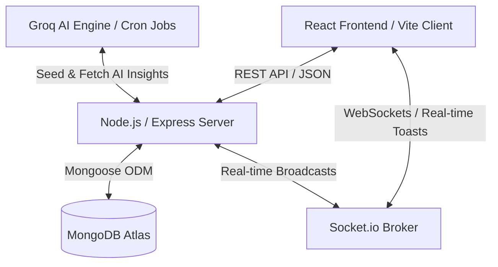

# Wagr.io — AI-Powered Social Prediction Exchange

Wagr.io is a state-of-the-art fintech prediction exchange platform that enables users to forecast the outcomes of real-world events and trade contracts using a virtual currency known as **Market Exchange Points (MXP)**. It transforms prediction markets into an interactive, collective forecasting experience by combining financial trading mechanics, real-time news aggregation, gamified social networking, and AI-driven automation.

> **"The Future Has Odds."** — Predict real-world events across Tech, Finance, Politics, World News, and Crypto with zero financial risk.

---

## 🌟 Core Features & Recent Highlights

- **Prediction Markets**: Multi-category binary event forecasting with real-time probability recalculations.
- **MXP Wallet & Admin Request Hub (`/wallet`)**: Dedicated wallet portal to track balance breakdowns, transaction logs, and submit MXP credit requests directly to administrators.
- **Client-Side PDF Export System**: Generate downloadable, formatted PDF documents for **Bets History**, **MXP Wallet Log**, **Privacy Policy**, and **Terms & Conditions**.
- **Interactive Vinyl Turntable Music Player**: Custom vinyl record player with spinning record animations, album art, tonearm needle movement, and single-line `TextRepel` heading (*"Song You Didn't Bet On"*).
- **Interactive Eye-Tracking FAQ Section**: 2-column Help Center featuring cursor-following eye animations and expanded platform FAQs.
- **Price History & Shift Logs Table**: Timestamped probability tracking on `MarketDetails.tsx` displaying YES/NO odds shifts, payout multipliers, and trade volume causes.
- **Guaranteed Active Open Markets**: 6 active short-term and 6 active long-term markets maintained continuously for instant trading.
- **AI Engine & Linked News**: Automatic news indexing using natural language processing to map breaking headlines side-by-side with market odds.
- **Global Leaderboards & Achievements**: Compete against top predictors, earn accuracy ratings, and unlock profile badges.
- **Admin Management Panel**: Dashboard for reviewing user MXP credit requests, approving/rejecting proposals, user suspensions, and content moderation.

---

## ⚔️ Competitive Comparison (Wagr vs. Competition)

| Feature | Wagr.io | Polymarket | Kalshi |
| :--- | :---: | :---: | :---: |
| **Asset Class** | **Virtual MXP Economy** (Risk-Free) | Cryptocurrency (USDC) | Fiat Currency (USD) |
| **Market Creation** | **AI-Assisted Event Scraper** | Manual Analyst Drafting | Manual Exchange Listing |
| **Linked News Briefs** | **AI Impact Analyst Summaries** | Static links only | No integrated news feed |
| **PDF Export Hub** | **Bets, MXP & Legal PDF Exports** | None | Basic CSV export |
| **Community Feed** | **Native Social Forum** | Limited external channels | None |
| **Gamification** | **Badges & Achievements** | Leaderboard only | None |
| **Accessibility** | **Instant Sandbox Play** | Requires Web3 Wallets | Requires Bank Wire Details |

---

## 🏗️ System Design & Architecture Flow

### High-Level Architecture Components

Wagr.io is structured around a decoupled **MERN client-server architecture** with web socket channels enabling live event streaming.



---

## ⚙️ Environment Variables Configuration (`.env.example`)

Wagr includes pre-configured environment template files for both the backend and frontend.

### 1. Backend Environment Setup (`backend/.env.example`)

Copy `backend/.env.example` to `backend/.env`:

```bash
cp backend/.env.example backend/.env
```

```env
# Server & Node Settings
PORT=5050
NODE_ENV=development
CLIENT_URL=http://localhost:3003

# MongoDB Atlas Connection URI
MONGO_URI=mongodb+srv://<username>:<password>@cluster.mongodb.net/wagr?retryWrites=true&w=majority

# JWT Authentication Security
JWT_SECRET=your_super_secret_jwt_key_here_change_this_in_production
JWT_EXPIRES_IN=7d

# Groq AI API Keys (Obtain free API key from https://console.groq.com)
LONG_TERM_MARKET_API_KEY=gsk_your_groq_api_key_here
SHORT_TREM_MARKET_API_KEY=gsk_your_groq_api_key_here
LONG_TERM_MARKET_NEWS_API_KEY=gsk_your_groq_api_key_here
SHORT_TERM_MARKET_NEWS_API_KEY=gsk_your_groq_api_key_here
```

### 2. Frontend Environment Setup (`frontend/.env.example`)

Copy `frontend/.env.example` to `frontend/.env`:

```bash
cp frontend/.env.example frontend/.env
```

```env
# Backend REST API & WebSockets Server URL
VITE_API_BASE_URL=http://localhost:5050/api/v1
VITE_SOCKET_URL=http://localhost:5050
```

---

## 📂 Directory Structure

```text
wagr/
├── frontend/                     # React Single Page Application (Vite + TailwindCSS)
│   ├── src/
│   │   ├── components/           # Reusable UI widgets
│   │   │   ├── ui/               # MusicPlayer, EyeTracking, CardStack, TextRepel
│   │   │   ├── Navbar.tsx        # Responsive header with centered links & Wallet badge
│   │   │   ├── FaqSection.tsx    # 2-column interactive FAQ with eye tracking
│   │   │   └── ToastNotification # WebSocket event toast overlay
│   │   ├── pages/                # Route Views
│   │   │   ├── Home.tsx          # Landing & Marketing Showcase
│   │   │   ├── Dashboard.tsx     # Portfolio dashboard & User Profile credentials card
│   │   │   ├── Wallet.tsx        # MXP Wallet hub & Admin credit request modal
│   │   │   ├── MarketDetails.tsx # Live chart, Price History table & trading deck
│   │   │   ├── AdminPanel.tsx    # Approval queue, MXP credit requests tab & moderation
│   │   │   ├── PrivacyPolicy.tsx # Expanded 5x privacy policy document
│   │   │   └── TermsConditions.tsx # Expanded 5x terms and conditions document
│   │   ├── utils/
│   │   │   └── pdfExporter.ts    # Client-side PDF export utility (jspdf)
│   │   └── App.tsx               # Router configuration
│   └── .env.example              # Frontend environment template
│
├── backend/                      # Node.js + Express REST API Server
│   ├── src/
│   │   ├── config/               # DB connection & database seeder
│   │   ├── controllers/          # Business logic (User, Market, Admin, Auth)
│   │   ├── middleware/           # JWT authentications, rate limiting, and roles validator
│   │   ├── models/               # Mongoose DB Schemas (User, Market, Position, MxpRequest)
│   │   ├── routes/               # Express API router maps
│   │   ├── services/             # Market resolution engine, cron jobs, notifications
│   │   └── app.js                # Express App routing & central error handlers
│   ├── server.js                 # HTTP & Socket.IO server entry point
│   └── .env.example              # Backend environment template
└── README.md                     # Project documentation
```

---

## 🚀 Step-by-Step Installation & Local Setup

### 1. Clone the Repository
```bash
git clone https://github.com/Apurvk28/wagr.git
cd wagr
```

### 2. Configure Environment Files
```bash
cp backend/.env.example backend/.env
cp frontend/.env.example frontend/.env
```

### 3. Install All Dependencies
```bash
npm run install-all
```

### 4. Run Development Servers
```bash
npm run dev
```
- **Backend Server:** Runs on `http://localhost:5050`
- **Frontend App:** Runs on `http://localhost:3003`

### 5. Default Admin Credentials
When connected to MongoDB, the system automatically seeds default administrator accounts:
- **Email:** `admin@wagr.io` | **Password:** `AdminPassword123!`
- **Email:** `apurv@gmail.com` | **Password:** `AdminPassword123!`

---

## 📄 License & Intellectual Property

© 2026 **Wagr.io** — All Rights Reserved. Built with React, Node.js, Express, MongoDB, TailwindCSS, and Framer Motion.
