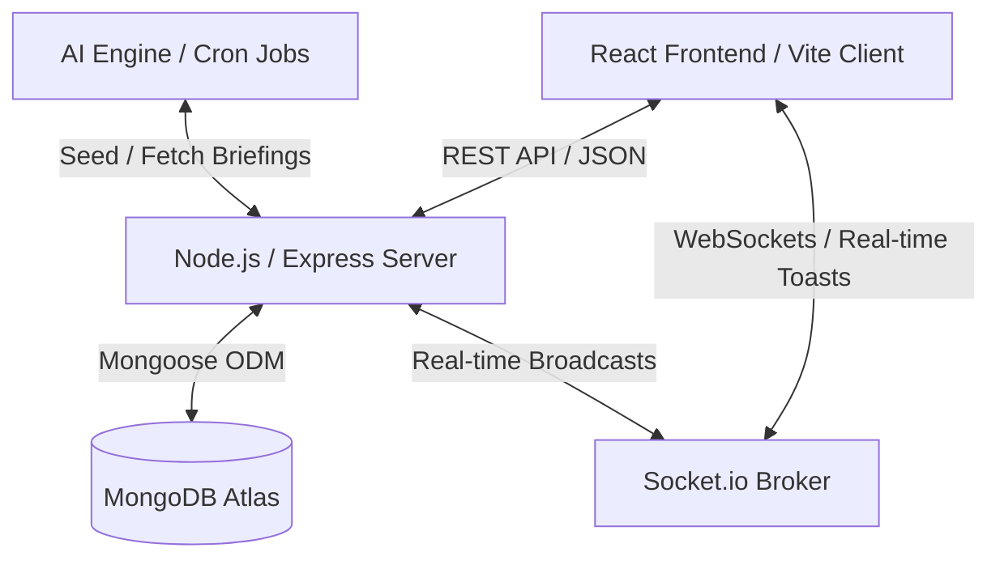
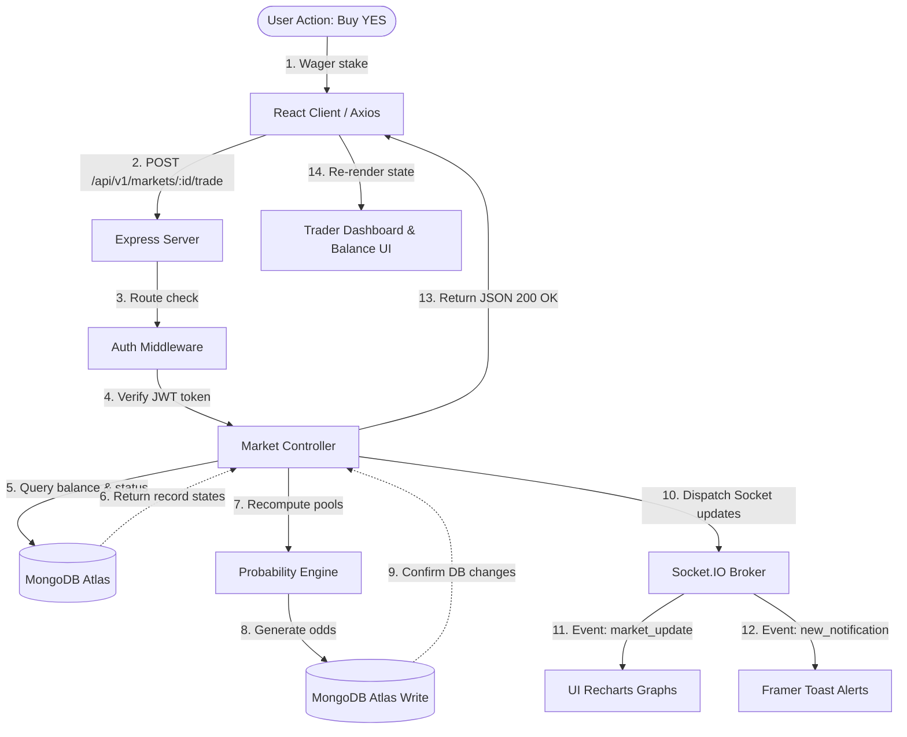
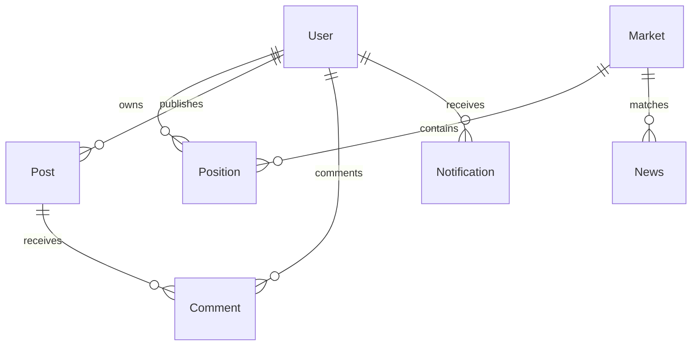

# Wagr.io — AI-Powered Social Prediction Exchange

Wagr.io is a modern fintech prediction exchange platform that enables users to forecast the outcomes of real-world events and trade contracts using a virtual currency known as **Market Exchange Points (MXP)**. It transforms prediction markets into an interactive, collective forecasting experience by combining financial trading mechanics, real-time news aggregation, gamified social networking, and AI-driven automation.

---

## 🌟 Core Features

- **Prediction Markets**: Multi-category binary event forecasting with real-time probability recalculations.
- **News Hub**: AI-summarized news feed linking real-world events to prediction contracts.
- **Community Forum**: Discussion board containing text-based posts, comments, nested replies, likes, user follows, and inline market links.
- **AI Engine**: Automated discovery of new events, draft market proposal drafting, duplicate check, and content safety moderation.
- **Wallet & Portfolio**: Interactive dashboards for tracking MXP balance, position value, profit/loss, and accuracy metrics.
- **Global Leaderboards**: Climbs ranks among top profit-makers and prediction accuracy traders.
- **Gamified Achievements**: Level up, earn profile badges, and unlock rewards through trades, follows, and approvals.

---

## 🏆 What Makes Wagr.io Unique? (Highlights)

Wagr.io bridges fintech prediction mechanisms, AI news feeds, and social interaction, creating a gamified forecasting community.

1. **AI-Driven Event Scrapers:** Wagr automatically identifies prediction-worthy events by monitoring real-world headlines, building draft contracts for review.
2. **Linked News Context:** Traders see news updates side-by-side with market details, with an AI analysis detailing the likely impact on YES/NO contract probabilities.
3. **No Financial Barriers:** Utilizing virtual MXP points removes the regulatory hurdles and risks of real-money gambling, making the platform accessible to a broad audience looking to test their forecasting skills.
4. **Gamification & Social Interaction:** Blending a community forum with achievements and badges ensures users can communicate insights and track accomplishments together.

---

## ⚔️ Competitive Comparison (Wagr vs. Competition)

| Feature | Wagr.io | Polymarket | Kalshi |
| :--- | :---: | :---: | :---: |
| **Asset Class** | **Virtual MXP Economy** (Risk-Free) | Cryptocurrency (USDC) | Fiat Currency (USD) |
| **Market Creation** | **AI-Assisted Event Scraper** | Manual Analyst Drafting | Manual Exchange Listing |
| **Linked News briefs** | **AI Impact Analyst Summaries** | Static links only | No integrated news feed |
| **Community Feed** | **Native Social Forum** | Limited external channels | None |
| **Gamification** | **Badges & Achievements** | Leaderboard only | None |
| **Accessibility** | **Instant Sandbox Play** | Requires Web3 Wallets | Requires Bank wire details |

---

## 🏗️ System Design & Architecture Design Flow

### 1. High-Level Architecture Components

Wagr.io is structured around a decoupled **MERN client-server architecture** with web socket channels enabling live event streaming.



### 2. Request Lifecycle & Pipeline Flow

The chart below shows how a trader request traverses the stack down to the database and broadcasts updates:



---

## 📂 Project Directory Structure

```text
wagr/
├── frontend/                     # React Single Page App
│   ├── src/
│   │   ├── components/           # Reusable UI widgets
│   │   │   ├── guards/           # Protected route controls (ProtectedRoute, AdminRoute)
│   │   │   ├── Navbar.tsx        # Responsive header with Search Bar and Profile menus
│   │   │   └── ToastNotification.tsx # Framer-motion Toast Alert stacker
│   │   ├── context/              # Global React States (AuthContext, SocketContext)
│   │   ├── pages/                # Route Page Views
│   │   │   ├── Home.tsx          # Landing & Marketing Showcase
│   │   │   ├── Dashboard.tsx     # Portfolio dashboard (Positions, History, Achievements)
│   │   │   ├── Leaderboard.tsx   # Top profit & accuracy podium tables
│   │   │   ├── AdminPanel.tsx    # Approval queue, suspension dashboard, & post deletes
│   │   │   ├── MarketsList.tsx   # Event marketplace with follow tags
│   │   │   └── MarketDetails.tsx # Live chart, buy/close panel, and comments thread
│   │   ├── services/             # Axios REST client API request layer
│   │   └── utils/                # Date and Currency formatting helpers
│   └── vite.config.ts            # Build configuration
│
├── backend/                      # Node.js Server Application
│   ├── src/
│   │   ├── config/               # DB connection & database seeder
│   │   ├── controllers/          # Business logic handlers
│   │   ├── middleware/           # JWT authentications, rate limiting, and roles validator
│   │   ├── models/               # Mongoose DB Schemas
│   │   ├── routes/               # API endpoints maps
│   │   ├── services/             # Core engines (Achievements, WebSockets, News, Trading)
│   │   └── app.js                # Express App routing & central error handlers
│   ├── server.js                 # HTTP & Socket.IO server starter
│   └── .env                      # Application environment variables config
```

---

## 🗄️ Database Schemas & Collections



### 1. Users Collection (`User`)
Stores account authentication data, wallet balances, prediction stats, followers list, and unlocked achievements badges.

| Field Name | Type | Validation / Defaults | Description |
| :--- | :--- | :--- | :--- |
| `_id` | ObjectId | Auto-generated | Unique identifier. |
| `fullName` | String | Required, trimmed | Display name of the user. |
| `username` | String | Unique, lowercase, indexed | Username identifier (e.g. `@trader1`). |
| `email` | String | Unique, lowercase, indexed, match regex | Verified electronic mail address. |
| `password` | String | Required, min 8 chars, select: false | Hashed account access credentials. |
| `mxpBalance` | Number | Default: 500 (credited on verify) | Wallet balance available for opening trades. |
| `portfolioValue` | Number | Default: 500 | Wallet balance + current value of open positions. |
| `predictionAccuracy` | Number | Default: 0 | Ratio of wins over total resolved contracts (%). |
| `followers` | Array[ObjectId] | Ref: `User` | Users who follow this profile. |
| `following` | Array[ObjectId] | Ref: `User` | Profiles this user follows. |
| `followedMarkets` | Array[ObjectId] | Ref: `Market` | Markets bookmarked for alerts. |
| `followedCategories` | Array[String] | Categories followed | Market categories chosen for notification. |
| `achievements` | Array[Subdocument] | Code & Date | Unlocked profile badges (e.g. `MXP_TYCOON`). |
| `role` | String | Enum: `['User', 'Admin']`, default: `User` | Access permissions indicator. |
| `isVerified` | Boolean | Default: `false` | Email verification check. |

---

### 2. Markets Collection (`Market`)
Details prediction contracts, categories, probability histories, trading pools, and status states.

| Field Name | Type | Validation / Defaults | Description |
| :--- | :--- | :--- | :--- |
| `title` | String | Required | Event question (e.g., "Will Apple launch AI glasses?"). |
| `description` | String | Required | Rules, verification criteria, and guidelines. |
| `category` | String | Required | E.g. `Finance`, `Artificial Intelligence`, `Technology`. |
| `yesProbability` | Number | Default: 50 | Current calculated probability of outcome YES. |
| `noProbability` | Number | Default: 50 | Current calculated probability of outcome NO. |
| `totalYesPool` | Number | Default: 0 | Total MXP staked on YES. |
| `totalNoPool` | Number | Default: 0 | Total MXP staked on NO. |
| `volume` | Number | Default: 0 | Sum of all MXP traded. |
| `status` | String | Enum: `['Pending Approval', 'Live', 'Resolved', 'Cancelled']` | Operational status of the market. |
| `resolutionDate` | Date | Required | Lock date when prediction trading ceases. |
| `resolutionResult` | String | Enum: `['YES', 'NO']` | Final resolved outcome of the event. |
| `createdBy` | ObjectId | Ref: `User` | User who proposed the contract. |
| `participants` | Array[ObjectId] | Ref: `User` | List of traders who opened a position. |
| `probabilityHistory` | Array[Subdocument] | yesProbability & Date | Timestamped history for generating Recharts area graphs. |

---

### 3. Positions Collection (`Position`)
Tracks active prediction holdings, staked amounts, purchase prices, and settlement outcomes.

| Field Name | Type | Validation / Defaults | Description |
| :--- | :--- | :--- | :--- |
| `userId` | ObjectId | Ref: `User`, Required, Indexed | Position owner. |
| `marketId` | ObjectId | Ref: `Market`, Required, Indexed | Prediction contract. |
| `outcome` | String | Enum: `['YES', 'NO']` | Target prediction choice. |
| `investedAmount` | Number | Required | MXP staked to open position. |
| `entryProbability` | Number | Required | Probability price of contract at time of trade. |
| `status` | String | Enum: `['Open', 'Closed', 'Resolved']` | Active state of the holding. |
| `exitValue` | Number | Optional | Payout returned to user balance upon sell or resolution. |
| `profitLoss` | Number | Default: 0 | Final MXP earned or lost from this position. |
| `closedAt` | Date | Optional | Timestamp when sold or resolved. |

---

### 4. Notifications Collection (`Notification`)
Maintains an inbox of historical notifications for user alerts.

| Field Name | Type | Validation / Defaults | Description |
| :--- | :--- | :--- | :--- |
| `userId` | ObjectId | Ref: `User`, Required, Indexed | Notification recipient. |
| `sender` | ObjectId | Ref: `User`, Optional | Trigger user. |
| `title` | String | Required | Notification title. |
| `message` | String | Required | Body description. |
| `type` | String | Enum: `['Market Resolved', 'Follow', 'Like', 'Comment', ...]` | Notification category type. |
| `redirectUrl` | String | Required | Dashboard route link on click. |
| `isRead` | Boolean | Default: `false` | Unread status check. |

---

### 5. Community Collections (`Post` & `Comment`)
Powers discussions and interactions directly connected to prediction contracts.

#### Collection: `Post`
- `userId` (Ref: `User`): Publisher.
- `content` (String): Discussion text.
- `likes` (Array[Ref: `User`]): Users who liked the post.
- `createdAt` / `updatedAt` (Timestamps).

#### Collection: `Comment`
- `userId` (Ref: `User`): Author.
- `postId` (Ref: `Post`): Target thread.
- `content` (String): Comment body.

---

### 6. News Collection (`News`)
Stores briefings connected to active markets.

- `headline` (String): Aggregator title.
- `summary` (String): Brief overview.
- `source` (String): E.g., Reuters, TechCrunch.
- `url` (String): Source reference hyperlink.
- `category` (String): Matching category.
- `relatedMarket` (Ref: `Market`): Connected contract.
- `aiSummary` (String): AI analysis of market probability impact.

---

## ⚡ Core Computational Mechanics & Probability Engine

### 1. Probability Engine & P2P Liquidity Pools

Rather than relying on set odds, Wagr.io uses **peer-to-peer liquidity pools** to generate odds dynamically. Market probabilities adapt in real time as user participation changes.

- **The YES Pool:** The total sum of all MXP virtual points staked by traders predicting the outcome will be **YES**.
- **The NO Pool:** The total sum of all MXP virtual points staked by traders predicting the outcome will be **NO**.
- **Virtual Liquidity Buffer ($1000$ MXP):** Added to both pools at the initialization step to prevent a division-by-zero error and ensure newly proposed markets start at neutral, balanced $50\% - 50\%$ odds.

#### The Mathematical Equation:

$$\text{YES Probability} = \text{round}\left( \frac{\text{YesPool} + 1000}{\text{YesPool} + \text{NoPool} + 2000} \times 100 \right)$$

$$\text{NO Probability} = 100 - \text{YES Probability}$$

#### Simple Numerical Example:
1. **Initial State (New Market):**
   * $\text{YES Pool} = 0$, $\text{NO Pool} = 0$.
   * $\text{YES Probability} = \frac{0 + 1000}{0 + 0 + 2000} \times 100 = 50\%$.
2. **Trader A wagers 3,000 MXP on YES:**
   * $\text{YES Pool} = 3000$, $\text{NO Pool} = 0$.
   * $\text{YES Probability} = \frac{3000 + 1000}{3000 + 0 + 2000} \times 100 = \frac{4000}{5000} \times 100 = 80\%$.
   * $\text{NO Probability}$ automatically becomes $20\%$.
3. **Trader B wagers 1,000 MXP on NO:**
   * $\text{YES Pool} = 3000$, $\text{NO Pool} = 1000$.
   * $\text{YES Probability} = \frac{3000 + 1000}{3000 + 1000 + 2000} \times 100 = \frac{4000}{6000} \times 100 = 67\%$.
   * $\text{NO Probability}$ becomes $33\%$.

*As more points accumulate on one side, the probability rises, shifting the entry price for subsequent traders. This represents collective intelligence in action.*

### 2. Trading Operations
- **Open Trade:** Deducts MXP from `mxpBalance`. Stored as an `Open` Position.
- **Close Position:** User can manually exit before resolution. Exit value is:
  $$\text{Exit Value} = \text{round}\left( \text{InvestedAmount} \times \frac{\text{Current Probability}}{\text{Entry Probability}} \right)$$
- **Resolution Settlement:** If market resolves to winning outcome:
  $$\text{Winning Payout} = \text{round}\left( \text{InvestedAmount} \times \frac{100}{\text{Entry Probability}} \right)$$
  If losing, value becomes 0 (worthless).

---

## 🚀 Setup & Installation

### 1. Prerequisites
- **Node.js** (v16+)
- **MongoDB** (Local Community Server or Atlas URL link)

### 2. Configuration
Create `/backend/.env` file:
```env
PORT=5000
MONGO_URI=mongodb+srv://...
JWT_SECRET=yourSuperSecretJWTKey123!
JWT_EXPIRES_IN=7d
CLIENT_URL=http://localhost:5173
```

Create `/frontend/.env` file:
```env
VITE_API_URL=http://localhost:5000/api/v1
```

### 3. Installation Commands
```bash
# 1. Install all dependencies across workspaces
npm run install-all

# 2. Run local development servers (Backend & Frontend)
npm run dev

# 3. Seed Mock Database Data (Automatic on MongoDB connect)
# Uses /backend/src/config/db.js to seed default admin user:
# Email: admin@wagr.io | Password: AdminPassword123!
```
