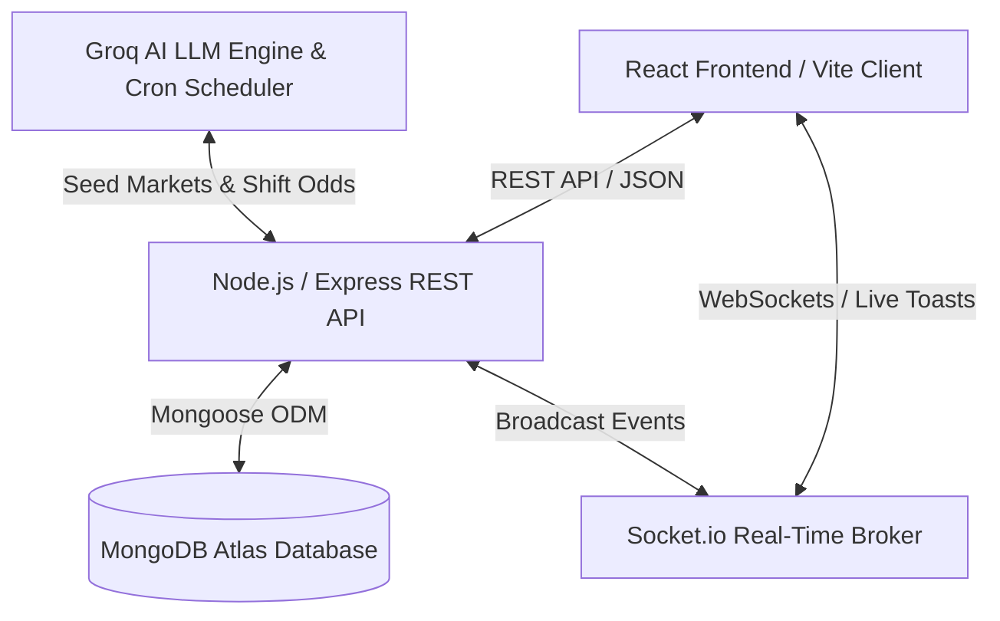

# Wagr.io — AI-Powered Social Prediction Exchange

> **"The Future Has Odds."** — Predict real-world events across Tech, Finance, Politics, World News, and Crypto with zero financial risk using Market Exchange Points (MXP).

Wagr.io is a state-of-the-art fintech prediction exchange platform that enables users to forecast real-world outcomes and trade event contracts. Combining financial trading mechanics, real-time news aggregation, automated AI market sentiment manipulation, social community engagement, and a risk-free virtual currency economy (**Market Exchange Points - MXP**), Wagr transforms speculative forecasting into an immersive, gamified experience.

---

## 🌟 Key Capabilities & Platform Highlights

### 1. Daily Calendar Short-Term & Long-Term Market Lifecycle
- **Daily Short-Term Lifecycle**: Short-term contracts run on a strict daily schedule:
  $$\text{12:05 AM Generation} \longrightarrow \text{OPEN / TRADING} \longrightarrow \text{11:00 PM Expiration} \longrightarrow \text{11:00 PM - 12:05 AM Break (65 Min)} \longrightarrow \text{RESOLVED}$$
- **Timezone Robustness**: Expiration (11:00 PM) and daily refresh (12:05 AM) follow Wagr's configured application timezone (`APP_TIMEZONE`, default `Asia/Kolkata`) through robust `dateUtils.js` ISO 8601 calculations, ensuring zero clock drift across client and server runtimes.
- **Long-Term Milestone Contracts**: 24/7 continuous trading contracts tracking macroeconomic shifts, election results, corporate earnings, and industry milestones with fixed calendar resolution targets.

### 2. Automated AI Market Sentiment & Manipulation Engine
- **Groq LLM Headline Impact Analysis**: Wagr continuously ingests breaking news streams and processes headline sentiment using Groq AI LLM models.
- **Dynamic Odds & Probability Shifts**: AI sentiment vectors recalculate market probabilities in real time between **1% ($1)** and **99% ($99)**, dynamically moving YES/NO liquidity pools.
- **Prominent Legal Disclosures**: Transparent disclosures featured in both [Terms & Conditions](file:///Users/apurvkhairnar/Wagr/frontend/src/pages/TermsConditions.tsx) (`Section 4`) and [Privacy Policy](file:///Users/apurvkhairnar/Wagr/frontend/src/pages/PrivacyPolicy.tsx) (`Section 5`) highlighting automated AI sentiment adjustments.
- **Grounded Final Resolution Guarantee**: While AI algorithms shift active trading sentiment, contract resolutions are strictly executed against verifiable real-world facts. Zero user PII is transmitted to AI API endpoints.

### 3. Detailed "How to Play" Educational Hub (`/how-to-play`) & Navbar Quick Popover
- **Interactive Guide Hub**: Complete breakdown of the MXP virtual token economy, short-term vs. long-term contract mechanics, probability pricing, early position cashing out, AI sentiment dynamics, and leaderboards.
- **Quick How to Play Popover**: Accessible anywhere in the application via the `(?)` icon embedded directly adjacent to the Global Search button in the primary header.

### 4. Refined Navbar Design & Ergonomics
- **Optimized Action Cluster**: Placed the **How to Play (`?`)** button directly next to the **Global Search (`🔍`)** button for intuitive, one-click access.
- **Streamlined Layout**: Clean header navigation bar featuring centered route links, live search overlay, wallet balance pill, notification bell, and user profile management menu.

### 5. MXP Virtual Token Economy & Admin Request Hub (`/wallet`)
- **Risk-Free Sandbox Trading**: New users start with **1,000 MXP**. Daily login streaks reward active predictors.
- **MXP Credit Request Portal**: Users can submit formal MXP balance credit requests with custom justifications directly to system administrators for review.
- **Transaction Audit Trail**: Detailed ledger tracking initial grants, trade purchases, early cashouts, contract payouts, daily streak bonuses, and admin credits.

### 6. Client-Side PDF Export System
- Formatted PDF report generation powered by `jspdf` for:
  - **Bets History Report**: Itemized breakdown of active and resolved positions, entry prices, shares, and net P&L.
  - **MXP Wallet Log**: Official ledger statement of wallet credit and debit transactions.
  - **Privacy Policy & Terms & Conditions**: Official legal compliance PDF exports.

### 7. Interactive UI Components & Gamification
- **Vinyl Turntable Music Player**: Custom interactive record player with spinning vinyl animations, album art, tonearm needle toggles, and single-line `TextRepel` heading (*"Song You Didn't Bet On"*).
- **Interactive Eye-Tracking FAQ**: 2-column help section featuring cursor-following eye animations and interactive accordion items.
- **Price History & Shift Logs Table**: Timestamped probability tracking on `MarketDetails.tsx` displaying odds shifts, payout multipliers, and trade volume triggers.
- **Global Leaderboard & Profile Ranks**: User accuracy ratings, level progression, profile badges, and global rank standings.

---

## ⚔️ Competitive Feature Comparison

| Feature | Wagr.io | Polymarket | Kalshi |
| :--- | :---: | :---: | :---: |
| **Asset Class** | **Virtual MXP Economy** (Risk-Free) | Cryptocurrency (USDC) | Fiat Currency (USD) |
| **Market Lifecycle** | **Daily Calendar (12:05 AM - 11:59 PM)** | Arbitrary Expirations | Fixed Expirations |
| **AI Sentiment Engine** | **Groq LLM Live News Impact** | None | None |
| **Legal AI Transparency** | **Prominent Disclosures** | N/A | N/A |
| **How to Play Guide** | **Detailed Hub & Navbar Popover** | External Docs | FAQ Page |
| **Linked News Briefs** | **AI Impact Summaries** | Static Links | No Integrated News |
| **PDF Export Hub** | **Bets, MXP & Legal PDFs** | None | Basic CSV |
| **Music Player** | **Vinyl Turntable Player** | None | None |
| **Community Feed** | **Native Social Forum** | External Discord | None |
| **Accessibility** | **Instant Sandbox Play** | Web3 Wallet Required | Bank Wire Required |

---

## 🏗️ System Architecture & Data Flow


```mermaid
graph TD
    Client[React Frontend / Vite Client]
    Server[Node.js / Express REST API]
    DB[(MongoDB Atlas Database)]
    Socket[Socket.io Real-Time Broker]
    AI[Groq AI LLM Engine & Cron Scheduler]

    Client <-->|REST API / JSON| Server
    Client <-->|WebSockets / Live Toasts| Socket
    Server <-->|Mongoose ODM| DB
    Server <-->|Broadcast Events| Socket
    AI <-->|Seed Markets & Shift Odds| Server
```

### Market Lifecycle Execution Flow

```text
[Cron: 12:05 AM] ──> Seed Today's Short-Term Markets ──> Status: OPEN
                           │
                           ├── User Trading (Buy YES/NO, Cash Out Early)
                           ├── AI News Scraper ──> Re-calculate Probabilities ($1 - $99)
                           │
[Cron: 11:00 PM] ──> Expiration & Lock Trading ────────> Status: LOCKED / RESOLVED
                           │
[11:00 PM - 12:05 AM] ──> 65-Minute System Break ─────> No Active Short-Term Markets
                           │
[Cron: 12:05 AM] ──> Seed Next Day's Markets ──────────> Status: OPEN
```

---

## ⚙️ Environment Configuration (`.env.example`)

### 1. Backend Configuration (`backend/.env.example`)

```env
# Server & Runtime Configuration
PORT=5050
NODE_ENV=development
CLIENT_URL=http://localhost:3003
APP_TIMEZONE=Asia/Kolkata

# Database Connection
MONGO_URI=mongodb+srv://<username>:<password>@cluster.mongodb.net/wagr?retryWrites=true&w=majority

# JWT Authentication
JWT_SECRET=your_super_secret_jwt_key_here_change_this_in_production
JWT_EXPIRES_IN=7d

# Admin Credentials Seeding
SEED_ADMIN_EMAIL=admin@yourdomain.com
SEED_ADMIN_PASSWORD=ChangeThisToAStrongPassword123!

# Groq AI API Keys (https://console.groq.com)
LONG_TERM_MARKET_API_KEY=gsk_your_groq_api_key_here
SHORT_TREM_MARKET_API_KEY=gsk_your_groq_api_key_here
LONG_TERM_MARKET_NEWS_API_KEY=gsk_your_groq_api_key_here
SHORT_TERM_MARKET_NEWS_API_KEY=gsk_your_groq_api_key_here
```

### 2. Frontend Configuration (`frontend/.env.example`)

```env
# API & WebSockets Endpoints
VITE_API_BASE_URL=http://localhost:5050/api/v1
VITE_SOCKET_URL=http://localhost:5050
```

---

## 🛠️ API Reference Summary

### Authentication Routes (`/api/v1/auth`)
- `POST /register`: Account registration with password strength verification.
- `POST /login`: User authentication & JWT issuance.
- `GET /me`: Fetch authenticated user profile & balance.
- `POST /claim-daily`: Claim daily login bonus MXP.

### Market Routes (`/api/v1/markets`)
- `GET /`: List active and resolved markets with filters.
- `GET /:id`: Detailed market view, price history, and news items.
- `POST /:id/trade`: Execute YES/NO share purchases.
- `POST /:id/cashout`: Cash out existing open position early.

### Wallet & MXP Requests (`/api/v1/wallet` & `/api/v1/mxp-requests`)
- `GET /logs`: Fetch MXP ledger transaction history.
- `POST /request`: Submit an admin MXP credit request.
- `GET /my-requests`: View user's submitted credit request statuses.

### Admin Panel Routes (`/api/v1/admin`)
- `GET /requests`: Review pending MXP credit requests.
- `POST /requests/:id/approve`: Approve credit request & deposit MXP.
- `POST /requests/:id/reject`: Reject credit request.
- `POST /users/:id/suspend`: Toggle user account suspension.

---

## 📂 Project Directory Structure

```text
wagr/
├── frontend/                     # React Single Page Application (Vite + TailwindCSS)
│   ├── src/
│   │   ├── components/           # UI Components
│   │   │   ├── ui/               # MusicPlayer, EyeTracking, CardStack, TextRepel, AnimatedBorderButton
│   │   │   ├── Navbar.tsx        # Responsive header with Search & How to Play button cluster
│   │   │   ├── QuickHowToPlayPopover.tsx # Header popover guide
│   │   │   ├── LiveClock.tsx     # Configurable digital clock component
│   │   │   ├── FaqSection.tsx    # Interactive FAQ section
│   │   │   └── ToastNotification # WebSocket event notifications
│   │   ├── pages/                # Application Views
│   │   │   ├── Home.tsx          # Landing & Marketing Showcase
│   │   │   ├── HowToPlayPage.tsx # In-depth detailed How to Play Guide Hub
│   │   │   ├── MarketsList.tsx   # Market discovery, category filters & search
│   │   │   ├── MarketDetails.tsx # Trading interface, chart, shift logs & linked news
│   │   │   ├── Dashboard.tsx     # User portfolio & position analytics
│   │   │   ├── Wallet.tsx        # MXP wallet hub & credit request modal
│   │   │   ├── AdminPanel.tsx    # Admin review queue & user moderation
│   │   │   ├── TermsConditions.tsx # Legal terms with AI sentiment disclosures
│   │   │   └── PrivacyPolicy.tsx # Privacy policy with AI data boundaries
│   │   ├── utils/
│   │   │   ├── pdfExporter.ts    # PDF export engine (jspdf)
│   │   │   └── index.ts          # MXP formatters & helper functions
│   │   └── App.tsx               # Main React router & layout context
│   └── .env.example              # Frontend environment template
│
├── backend/                      # Node.js + Express REST API & WebSocket Server
│   ├── src/
│   │   ├── config/               # Database connection & admin seeder
│   │   ├── controllers/          # Business logic controllers
│   │   ├── middleware/           # Auth JWT, rate limiting, and roles validator
│   │   ├── models/               # Mongoose ODM Schemas (User, Market, Position, MxpRequest)
│   │   ├── routes/               # Express API routes
│   │   ├── services/             # AI generation service, resolution engine & cron schedulers
│   │   ├── utils/                # Date Utilities & timezone helpers (`dateUtils.js`)
│   │   └── app.js                # Express Application entry & middleware setup
│   ├── server.js                 # HTTP & Socket.IO server initialization
│   └── .env.example              # Backend environment template
└── README.md                     # Comprehensive project documentation
```

---

## 🚀 Quickstart & Local Setup Guide

### 1. Clone & Setup Environments
```bash
git clone https://github.com/Apurvk28/wagr.git
cd wagr

cp backend/.env.example backend/.env
cp frontend/.env.example frontend/.env
```

### 2. Install Dependencies
```bash
npm run install-all
```

### 3. Start Development Servers
```bash
npm run dev
```
- **Backend Server**: `http://localhost:5050`
- **Frontend App**: `http://localhost:3003`

### 4. Admin Seeding
To automatically seed an initial administrator account upon server boot, populate `SEED_ADMIN_EMAIL` and `SEED_ADMIN_PASSWORD` in `backend/.env`.

---

## 📄 License & Intellectual Property

© 2026 **Wagr.io** — All Rights Reserved. Built with React, Node.js, Express, MongoDB, TailwindCSS, and Framer Motion.
